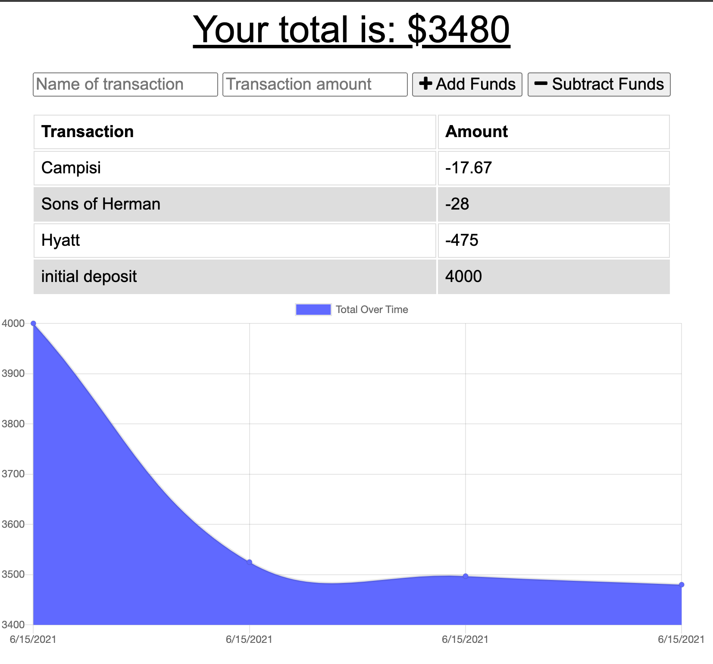

# Budget Tracker

## Table of Contents
* [Description](#description)
* [Technology](#technology)
* [Screenshots](#screenshots)
* [Demonstration](#demonstration)

## Description
This budget tracker is a full stack application designed so the user can add expenses and deposits to their budget with or without a connection. When entering transactions offline, they will populate the total when brought back online.

### Click this link to view the deployed application (https://secure-hollows-27877.herokuapp.com/) 

## Technology
* JavaScript
* Node.js
* Express.js
* MongoDB
* Mongoose ODM
* IndexedDB
* Webmanifest
* Progressive Web App

## Screenshots

## Demonstration

